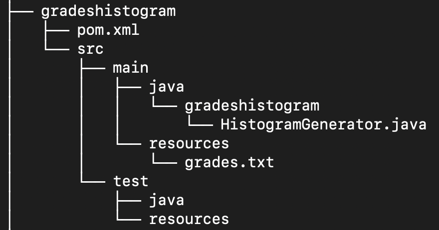
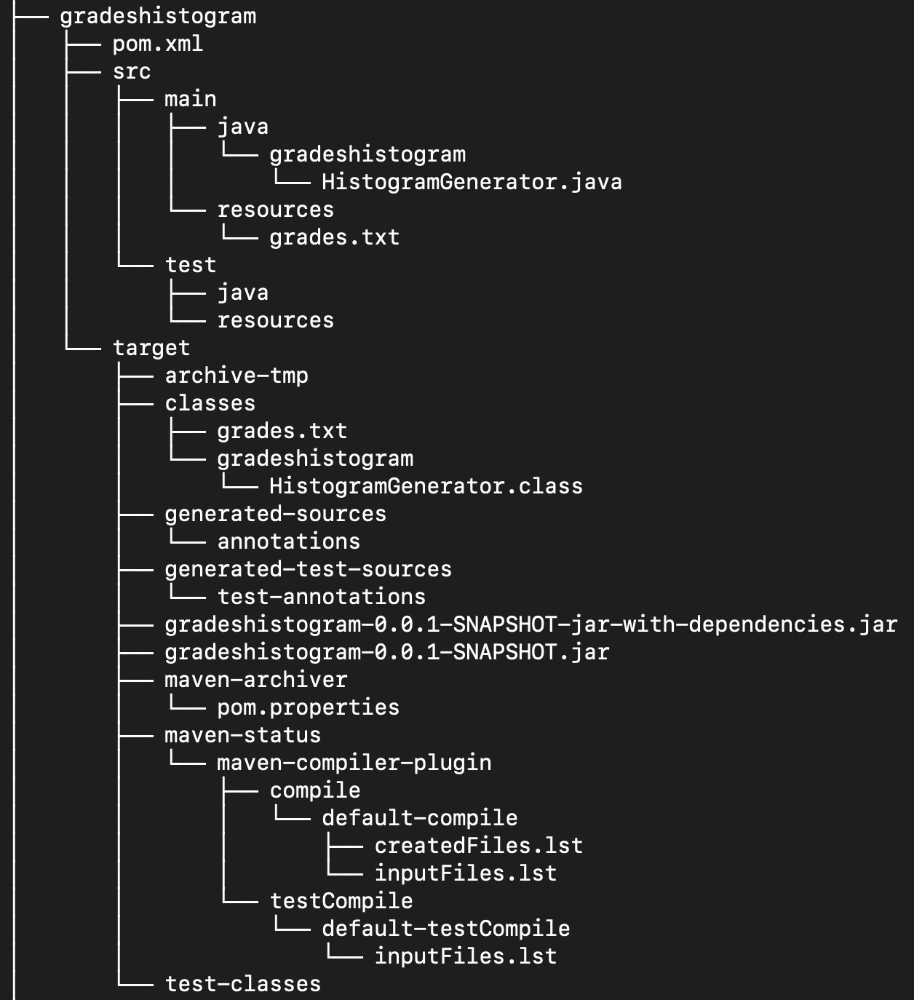

# SEIP Lab Assignments [](https://github.com/demetres12/seip-lab/actions)

<h1 align="center">
	
</h1>

# Table of contents
1. [Introduction](#introduction)
2. [Maven Assignment](#maven)
3. [Unit Testing Assignment](#unittesting)
4. [Continuous Integration](#ci)
5. [Code Coverage](#codecov)


## Introduction <a name="introduction"></a>

The main purpose of the current repository is the submission of the lab
assignments for the needs of Software Engineering in Practice course. 
Build automation tools, unit testing and design patterns, are some key 
demonstrative topics that will be covered through the practical assignments.

## Maven Assignment <a name="maven"></a>

Getting started with the Maven build automation tool, we structure a parent-module project.
Being dependant on the JFree java library, the module provides the functionality stated below:

1. Embedded in HistogramGenerator class, readGrades reads grades as integers, 
included in a txt file. The grades file is passed as command line argument
at runtime.
2. Provided with the grades, generateChart method generates the histogram, that being a XYLineChart chart.
3. The main method needs to call the above methods, in order to present the chart.


### Getting started with the Maven project

#### Software Requirements

- [Git](https://git-scm.com/)
- [Java](https://www.java.com/en/)
- [Maven](https://maven.apache.org/)


#### Project Structure

Implementing project inherintance, we follow an hierarchical parent - child structure, with:

- [seip-lab](https://www.github.com/demetres12/seip-lab) --> being the **parent**, and
	- [gradeshistogram](https://www.github.com/demetres12/seip-lab/tree/development-2/gradeshistogram) --> being the **module**

##### Structure of the module before building
<h1 align="center">
	
</h1>

##### Structure of the module after building

<h1 align="center">
	
</h1>


#### What to do?

1. First you will need to clone the maven project "seip-lab", so you can obtain the source code locally. We are going to do that through the terminal. For Unix-based OS open the utility application "Terminal", while for MS Windows use a Unix-like environment (e.g., CygWin).

```bash
git clone https://github.com/demetres12/seip-lab.git
```

2. Change directory and move to seip-lab. You can track your working directory, via the `pwd` command.

```bash
cd seip-lab
```

3. Build the project, executing the following commands, that represent the key default lifecycle phases.

```bash
mvn compile
```
```bash
mvn package
```

- Note that the `mvn package` command, includes the compilation of the project, so `mvn compile` command is not mandatory, but it comes in handy when we want to focus on compilation errors.
- In case you need to remove all files generated by the previous build, execute the command `mvn clean`, and notice that the target dir will be removed. Combining lifecycles is also a common case,(e.g., `mvn clean package`).
- Execute tests on compiled code, with the `mvn test` command.
- You may also check results of integration tests to ensure quality criteria are met, with the `mvn verify` command.

4. The build's output is placed under the target directory, containing the fat jar, which will be executed via the following command.

```java
java -jar gradeshistogram/target/gradeshistogram-0.0.1-SNAPSHOT-jar-with-dependencies.jar gradeshistogram/src/main/resources/grades.txt
```
Notice that the `jar-with-dependencies.jar` is the executable. Keep in mind that we use the `maven-assembly-plugin`, in order to package dependencies into the main .jar output file.

## Unit Testing Assignment <a name="unittesting"></a>

Regarding the unit testing practice project there is an individual [README](https://github.com/demetres12/seip-lab/blob/development-2/unittesting/README.md) file, that approaches the module in a practical and descriptive way.

## Continuous Integration <a name="ci"></a>

The current project utilizes Github Actions for the purpose of continuous integration. You may take a look
at the [workflow file](https://github.com/demetres12/seip-lab/blob/development-2/.github/workflows/maven.yml), where as declared, Github Actions CI services test and build the application upon each `push` and `pull-request`.

After each build, the badge is updated with the corresponding build status, green for passes and red for failures.

## Code Coverage <a name="codecov"></a>

[JaCoCo](https://github.com/jacoco/jacoco) is a code coverage reports generator for Java projects. Widely used for the needs of code coverage measurement and integrated with Maven build automation tool, JaCoCo helps us make our tests more *reliable* and *effective*.

In case you need to generate reports for the modules, just execute the following command.

```bash
mvn clean package jacoco:report
```

In the event we focus on the unittesting module, we need to change working directory, by:

```bash
cd unittesting/targe/site/jacoco
```

Eventually, the `jacoco` dir holds the generated reports in several formats (e.g., HTML,XML). Subsequently, `index.html` file provides the core information
regarding code coverage by lines, branches, methods etc.

<h1 align="center">
	
</h1>