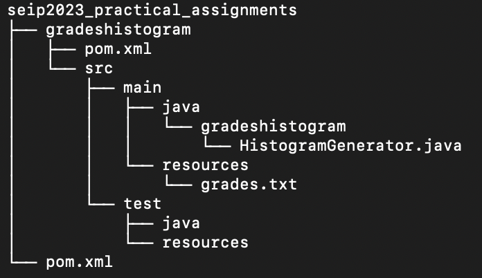
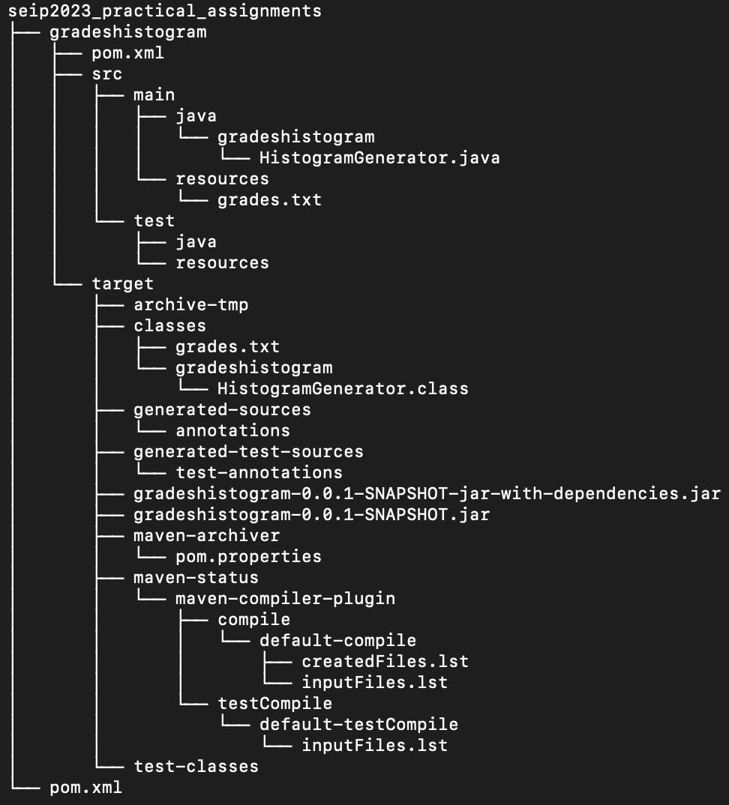

# SEIP Lab Assignments

The main purpose of the current repository, is the submission of the lab
assignments for the needs of the of Software Engineering in Practice course. 
Build automation tools, unit testing and design patterns, are some key 
demonstrative topics that will be covered through the practical assignments.

## Maven Assignment

Getting started with the Maven build automation tool, we structure a parent-module project.
Being dependant on the JFree java library, the module provides the functionality stated below:

1. Embedded in HistogramGenerator class, the program reads grades as integers, passed as a txt file command line argument during the runtime.
2. Passing the stored grades, a method generates the histogram, that being a XYLineChart chart.
3. The main method needs to call the above method, in order to present the chart.


### Getting started with the Maven project

#### Project Structure

Implementing project inherintance, we follow an hierarchical parent - child structure, with:

- [seip-lab](https://www.github.com/demetres12/seip-lab), being the **parent**, and
- [gradehistogram](https://www.github.com/demetres12/seip-lab/gradeshistogram), being the **module**

##### Structure before building
<h1 align="center">
	
</h1>

##### Structure after building

<h1 align="center">
	
</h1>


#### What to do?

1. First you will need to clone the project "seip-lab", so you can obtain the source code locally. We are going to do that through the terminal. For Unix-based os open the utility application "Terminal", while for MS Windows use a Unix-like environment, like CygWin.

```bash
git clone https://github.com/demetres12/seip-lab.git
```

2. Change directory and move to seip-lab. You can track your working directory, via the `pwd` command.

```bash
cd seip-lab
```

3. Build the project, executing the following commands, that represent the key default lifecycle phases. Note that executing `mvn package` command, also compiles the project. In case you need to re-build the project, execute the command `mvn clean`, and notice that the target dir will be removed.

```bash
mvn compile
```
```bash
mvn package
```

4. The build's output is placed under the target dir, containing the fat jar, which will be executed via the following command.

```java
java -jar gradeshistogram/target/gradeshistogram-0.0.1-SNAPSHOT-jar-with-dependencies.jar gradeshistogram/src/main/resources/grades.txt
```


