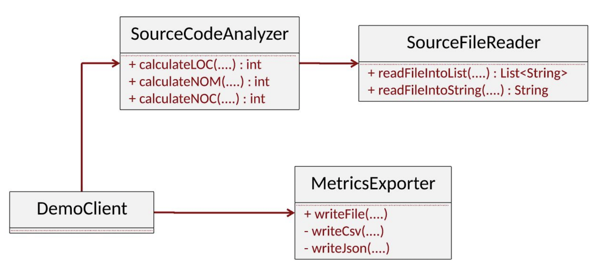
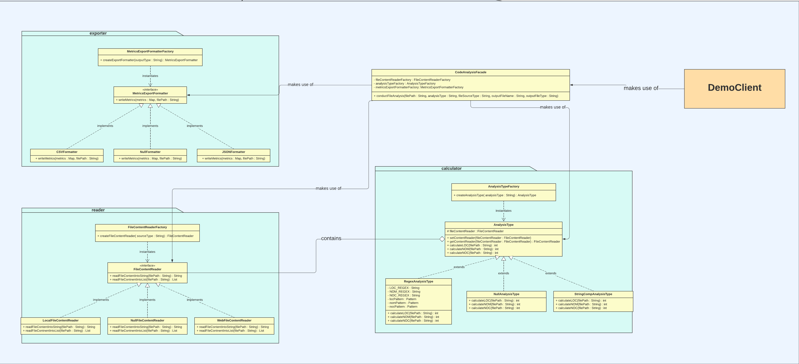
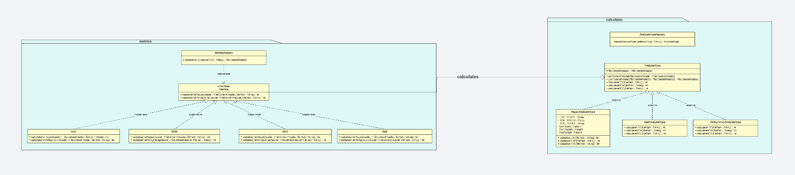

# Design Patterns Assignment

# Table of contents
- [Introduction](#introduction)
- [Overview on Design Patterns](#overview)
- [Creational Design Patterns](#creational)
  - [Simple Factory](#factory)
- [Structural Design Patterns](#structural)
  - [Bridge](#bridge)
  - [Facade](#facade)
- [Behavioral Design Patterns](#behavioral)
  - [Strategy](#strategy)
  - [Null Object](#nullobject)
6. [Step by Step](#stepbystep)


## Introduction <a name="introduction"></a>

The purpose of the current module is the representation of refactoring processes that should be performed
upon an existing poorly designed project. Identifying several design principles violation we implement
both creational, structural and behavioral design patterns, to redesign the system properly.
Following up to that approach, we construct a `maintenable`, `reusable` and `scalable` codebase that:
 
 - records low levels of `rigidity` and `fragility`
 - avoids unwanted complexity and repetition, by including additional abstraction levels
 - aligns software components with SOLID principles


### System design before refactoring

<h1 align="center">
	
</h1>


### System design after refactoring

<h1 align="center">
	
</h1>


#### About the refactored system structure

- We propose the creation of three sub-packages (i.e. `reader`, `calculator` and `exporter`) under the `codeanalyzer` package.
- As you may notice several abstraction levels were considered in order to follow the Interface Segregation principle, where many specific interfaces are better than general-purpose abstraction. (see `AnalysisType`, `MetricsExportFormatter` and `FileContentReader`)
- By refactoring the codebase, classes are now responsible for one operation and serve a single purpose. Furthermore, the current entities are open for extension, but not for modification.
- The design patterns applied are discussed below.

---

## Overview on Design Patterns <a name="overview"></a>


Design Patterns can be defined as typical solutions to common problems in software design. We may think
of them like a blueprint that we can customize to solve a particular design problem in our code.
They propose a way to address recurring design challenges and guide developers in creating well-structured
and maintainable code.

---

## Creational Design Patterns <a name="creational"></a>

Creational design patterns provide various object creation mechanisms and manage effectively object's instantiation.
Analytically, they help us encapsulate object creation and decouple client code from the specific classes being instantiated.
Overall, they are beneficial in terms of code flexibility and reusability.


### Simple Factory <a name="factory"></a>

#### Intention and Problem Solving

The Simple factory pattern refers to a class that has one creation method with a large conditional that based on method
parameters chooses which product class to instantiate and then return. We can think of it as an intermediate step of
introducing Factory Method or Abstract Factory patterns. Enacting the simple factory method, helps us hiding the objects'
creation logic from the client. Summarizing it covers the following problems:

- Exposure of the object creation logic
- Tight coupling between the client and the concrete classes
- Needless complexity and violation of the Interface Segregation principle

Example given:

```java
class FactoryExample {
    public Type create(providedLanguage) {
       if (providedLanguage.equalsIgnoreCase("Java")) {
            return new Java();
        } else if (providedLanguage.equalsIgnoreCase("Python")) {
           return new Python();
        } else {
           return new NullLanguage();
        }
    }
}
```

#### Implementation

Simple Factory is implemented within our project through:

- `reader` module with:
  - The `FileContentReaderFactory` class to be responsible for creating instances of the `FileContentReader` interface based on the provided source type.
  - The factory method `createFileContentReader` takes an `sourceType` parameter as an input and returns an instance of the corresponding concrete products, that being:
    - `LocalFileContentReader`
    - `WebFileContentReader`
    - `NullFileContentReader`

-  `calculator` module with:
  - The `AnalysisTypeFactory` class to be responsible for creating instances of the `AnalysisType` abstract class based on the provided analysis type.
  - The factory method `createAnalysisType` takes an `analysisType` parameter as an input and returns an instance of the corresponding concrete products, that being:
    - `RegexAnalysisType`
    - `StringCompAnalysisType`
    - `NullAnalysisType`

-  `exporter` module with:
  - The `MetricsExportFormatterFactory` class to be responsible for creating instances of the `MetricsExportFormatter` interface based on the provided output type.
  - The factory method `createExportFormatter` takes an `outputType` parameter as an input and returns an instance of the corresponding concrete products, that being:
    - `CSVFormatter`
    - `JSONFormatter`
    - `NullFormatter`


#### How does it affect our system?

Simple Factory seems to be a suitable and beneficial construction approach regarding our project as it's advantages outweigh the trade-offs.

##### Benefits

```diff
+ Encapsulation: The pattern encapsulates the object creation operation within the factory class and keep a loose coupling.
+ Decoupling: Clients are decoupled from the concrete classes creation. They interact only with the factory class, allowing for flexibility and ease of swapping concrete classes without impacting the client code.
+ Centralized Object Creation: The Simple Factory centralizes the object creation process in a single location, which simplifies maintenance and modifications and removes any unwanted complexity.
```

##### Trade-offs

```diff
- Limited flexibility: The Simple Factory pattern is not as flexible as other factory patterns like Factory Method or Abstract Factory.
- Violation of Open-Closed Principle: Adding a new concrete class to the Simple Factory pattern requires modifying the factory class, which violates the Open-Closed Principle
```

---


## Structural Design Patterns <a name="structural"></a>

Structural design patterns explain how to assemble objects and classes into larger structures, while keeping these structures flexible and efficient.
They optimize design and composition of classes and object, by organizing the code components and contributing to reusability and modularity.

### Bridge <a name="bridge"></a>

#### Intention and Problem Solving

Bridge design pattern lets us split a large class or a set of closely related classes into two separate hierarchies —**abstraction and implementation**— which can be developed independently of each other. We make use of the pattern when we need to extend a class in several independent dimensions. Some indicative problems Bridge covers are the following:

- Tight coupling between the abstraction and the implementation
- Limited scalability of our codebase
- Inseparable concepts of the abstraction and the implementation

#### Implementation

Bridge design pattern is reflected within our project by the `reader` and `calculator` modules. We follow the two hierarchies model: abstraction and implementation, with the former being the `AnalysisType` abstract class and the latter being the `FileContentReader` interface. 
Essentially, the **abstraction** hierarchy represents the high-level interface that clients interact with, while the **implementation** hierarchy provides the concrete implementations of that interface. We make use of the aforementioned pattern to mirror the composition between the two modules.

Practically, each and every analysis type has a file content reader. Moreover, the `Abstraction --> calculator` hierarchy holds a reference (that being the `AnalysisType.fileContentReader`) to an object of the `Implementation --> reader` hierarchy. The abstraction will be able to delegate some of its calls to the implementations object. Since all implementations will have a common interface, they’d be interchangeable inside the abstraction.


#### How does it affect our system?

Bridge seems to be a suitable and beneficial construction approach regarding our project as it's advantages outweigh the trade-offs.

##### Benefits

```diff
+ The client code works with high-level abstractions. It isn’t exposed to the platform details.
+ We follow the Open/Closed principle, by introducing new abstractions and implementations independently from each other.
+ We follow the Single Responsibility principle, by focusing on high-level logic in the abstraction and on platform details in the implementation.
```

##### Trade-offs

```diff
- We might make the code more complicated by applying the pattern to a highly cohesive class.
```


### Facade <a name="facade"></a>

#### Intention and problem solving

Facade design pattern provides a simplified interface to a library, a framework, or any other complex set of classes. Aims to hide the complexity of the underlying system and provide a unified and simplified interface for clients to interact with. We make use of the pattern when we need to have a limited but straightforward interface to a complex subsystem or we want to structure a subsystem into layers.Some indicative problems Bridge covers the following problems:

- Complexity of interfaces
- Exposure of complex systems interaction

#### Implementation

Facade design pattern is identified within our project as the highest layer of abstraction. Focusing on the `CodeAnalysisFacade`, that represents the pattern, we understand that:

-  It encapsulates the complexity of interacting with various components such as `FileContentReader`, `AnalysisType` and `MetricsExportFormatter`
- Internally, it delegates the responsibilities to the corresponding subsystem objects. It instantiates several factory classes:
  - `FileContentReaderFactory`
  - `AnalysisTypeFactory`
  - `MetricsExporterFormatterFactory`

  The aforementioned are used respectively to return the needed concrete objects, by calling the corresponding factory methods:
  - factory method: `CodeAnalysisFacade#createFileContentReader` returns / produces `CodeAnalysisFacade.fileContentReader` based on the `sourceType` 
  - factory method: `CodeAnalysisFacade#createAnalysisType` returns / produces `CodeAnalysisFacade.analyzer` based on the `analysisType`
  - factory method: `CodeAnalysisFacade#createExportFormatter` returns / produces `CodeAnalysisFacade.metricsExporter` based on the `outputFileType` 


#### How does it affect our system?

Facade seems to be a suitable and beneficial construction approach regarding our project as it's advantages outweigh the trade-offs.

##### Benefits

```diff
+ We can isolate our code from the complexity of a subsystem
+ Accomplish loose coupling between the components of the system
+ Make our code more readable and maintainable
+ Prevent fragility and needless repetition
```

##### Trade-offs

```diff
- The Facade pattern introduces an additional layer between clients and the subsystem, which can add complexity to the codebase.
- The abstraction provided by the Facade may not expose needed functionalities and customization options available in the underlying subsystems.
- Clients using the Facade can become tightly coupled to it, as it acts as the primary entry point to the subsystem.
```

---

## Behavioral Design Patterns <a name="behavioral"></a>

Behavioral design patterns are concerned with algorithms and the assignment of responsibilities between objects. We could think of them as a mechanism that focus on the interaction and communication between objects and classes.

### Strategy <a name="strategy"></a>

#### Intention and problem solving

Strategy design pattern lets us dynamically select a family of algorithms, include each of them into a separate class, and make their objects interchangeable. This pattern corresponds to the principle of Composition Over Inheritance and helps in achieving loose coupling between the context and the strategies. Strategy plays an instrumental role in terms of Open/Close design principle alignment and code reusability and testability

#### Implementation

Strategy design pattern is majorly used within our project. Specifically, is utilized by our three modules: `reader`, `calculator`, `exporter`, and operates as an intermediate layer of abstraction between the concrete classes (e.g., `CSVFormatter`) and the factory classes (e.g., `MetricsExportFormatterFactory`). Examining each module, the following interfaces/abstract classes mirror the Strategy implementation:

-  `reader` module:
  - The `FileContentReader` interface serves as an abstraction layer that defines the operations performed by:
    - `LocalFileContentReader`
	- `WebFileContentReader`
	- `NullFileContentReader`


-  `calculator` module:
  - The `AnalysisType` abstract class serves as an abstraction layer that defines the operations performed by:
    - `RegexAnalysisType`
	- `StringCompAnalysisType`
	- `NullAnalysisType`


-  `exporter` module:
  - The `MetricsExportFormatter` interface serves as an abstraction layer that defines the operations performed by:
    - `CSVFormatter`
	- `JSONFormatter`
	- `NullFormatter`

#### How does it affect our system?

Strategy seems to be a suitable and beneficial behavioral construction approach regarding our project as it's advantages outweigh the trade-offs.

##### Benefits

```diff
+ We effectively swap algorithms used inside an object at runtime.
+ We can isolate the implementation details of an algorithm from the code that uses it.
+ Replacing inheritance with composition aligns with the design principles.
+ We can introduce new strategies without having to change the context, following up the Open/Close design principle.
+ The Strategy pattern enhances testability as each strategy can be tested independently.
```

##### Trade-offs

```diff
- Clients are not aware of the differences between strategies to be able to select a proper one, and that may causes issues.
- When overused, it may result to unwanted complexity.
```


### Null Object <a name="nullobject"></a>

#### Intention and problem solving

Null Object design pattern provides an alternative approach for handling null references or missing objects in a more controlled and predictable manner.
What problem does it solve? Since some methods return null instead of real objects, you have many checks for null in your code. This makes our code "smell" and longer, by keeping multiple checks for `null`. What's the proposed solution? Instead of null, return a null object that exhibits the default behavior.

#### Implementation

Null Object is highly utilized by `reader`, `calculator` and `exporter` modules., by defining accordingly the concrete objects:
- `NullFormatter`
- `NullFileContentReader`
- `NullAnalysisType`

As you may notice, both mentioned classes throw an `IllegalArgumentException` when null objects call the corresponding methods.

#### How does it affect our system?

NullObject seems to be a suitable and beneficial behavioral construction approach regarding our project as it's advantages outweigh the trade-offs.

##### Benefits

```diff
+ Avoid dozens of null checks and prevent `NullPointerExceptions`.
+ Simplifies error handling.
+ Improves code readability and maintainability.
```


##### Trade-offs

```diff
- We pay the price of creating yet another new class as we are getting rid of conditionals.
- Dilution of clear error reporting.
```

---

### Some noteworthy comments regarding the design patterns

- We notice that both `Strategy`, `Simple Factory` and `Null Object` are related and interact one with each other and are applied to the total of the modules. If we need to describe the layering of the patterns, we could demonstrate it as the following findings:

  - with the Facade being the highest level of abstraction encapsulating the complexity of the subsystems,
  - the Simple Factory being built on top of the Strategy,
  - the Null Object to be embedded within the Simple Factory, but also implementing the interfaces provided by Strategy,
  - and the bridge an interoperable operation between the modules

- Another proposal one could consider in terms of further abstraction concept, is visualized below:

<h1 align="center">
	
</h1>

Essentially, we create a new abstraction layer for Metrics, that:

  - Implements the Strategy, introducing a `Metrics` interface.
  - Applies the Simple Factory and Null Object, by producing `LOC`, `NOC`, `NOM` and `Null` concretes metrics objects, via the factory method `MetricsFactory#createMetrics`.
  - Utilizes the Bridge pattern as there is be a composition relationship between the `calculator` and `metrics`.

However, this could add more unwanted complexity to our system and the further encapsulation concept of `Metrics` could possibly redundant.


## Step By Step <a name="stepbystep"></a>

1. Initially, it's recommended to take a look at the main [README](https://github.com/demetres12/seip-lab/blob/development-2/README.md), in order to get familiar with Maven's lifecycles.

2. Moreover, there is a detailed and explanatory overview on Unit Testing located in the unittesting's module [README](https://github.com/demetres12/seip-lab/blob/development-2/unittesting/README.md).

Executing the module requires the following steps:

1. Build the executable Java application with:

```bash 
	# clean --> It comes in handy when we need to clean the previous build
	# jacoco:report --> Generates data reports regarding the code coverage levels
	mvn clean package jacoco:report
```

2. Run the executable by:

```bash 
	java -jar “jar-with-dependencies” arg0 arg1 arg2 arg3 arg4
```

Where args translate to:

```	
	arg0 = “JavaSourceCodeInputFile” (e.g., src/test/resources/TestClass.java)
	arg1 = “sourceCodeAnalysisType” [regex|strcomp]
	arg2 = “SourceCodeLocationSourceType” [local|web]
	arg3 = “OutputFilePath” (e.g., ../output_metrics_file)
	arg4 = “OutputFileType” [csv|json]
```

Example given:

```bash
	# Be aware that your working directory must be the one including the pox.xml configuration file
	java -jar ./target/sourcecodeanalyzer-0.0.1-SNAPSHOT-jar-with-dependencies.jar ./src/test/resources/TestClass.java regex local generated_metrics csv
```

If everything is set properly you should receive a CLI message:

```
Metrics saved in <location>

```

