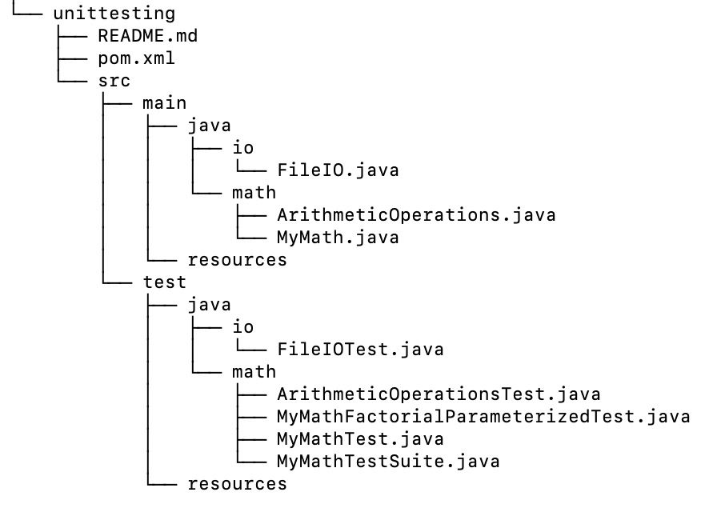

# Unit Testing

The current module serves the unit testing of several Java source files. Implemented with the Maven build
automation tool, several test cases evaluate the functionality of multiple operations. Aiming to verify
the tests' expected behavior, we take into consideration exception cases as well a plethora of challenging
instances. Being dependant on the JUnit testing framework (version 4.12), we apply a variety of techniques
for the needs of a sufficient testing coverage level.

## Getting started with the Unit Testing project

### Software Requirements

- [Git](https://git-scm.com/)
- [Java](https://www.java.com/en/)
- [Maven](https://maven.apache.org/)

### Project Structure

Implementing project inherintance, we follow an hierarchical parent - child structure, with:

- [seip-lab](https://www.github.com/demetres12/seip-lab) --> being the **parent**, and
	- [unittesting](https://www.github.com/demetres12/seip-lab/tree/development-2/unittesting) --> being the **module**

#### Structure of the module before building
<h1 align="center">
	
</h1>

#### Structure of the module after building

<h1 align="center">
	
</h1>

### Step by Step

1. First you will need to take a look at the main [README](https://github.com/demetres12/seip-lab/blob/development-2/README.md), in order to get familiar with Maven's lifecycles.

2. In case you need to run each and every test, execute the following command.

```bash
mvn test
```

3. Otherwise, to run an individual test class, the command stated below is what you need.

```bash
 mvn -Dtest=MyMathTest test
```
In our example, we run each and every test case / method in reference to the MyMathTest java class.

4. Finally, if you need to run a single test case / method, specify that by the upcoming command.

```bash
 mvn -Dtest=MyMathTest#factorial test
```
In our example, we run the `factorial` test case / method in reference to the MyMathTest java class.

- Note that only classes with a Test suffix located in the src/test will be executed and reported as Tests.

### Continuous Integration

The current project utilizes Github Actions for the purpose of continuous integration. You may take a look
at the [workflow file](https://github.com/demetres12/seip-lab/blob/development-2/.github/workflows/maven.yml), where as declared, Github Actions CI services test and build the application upon each `push` and `pull-request`. 
